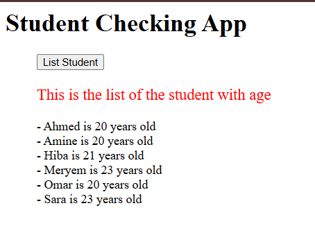
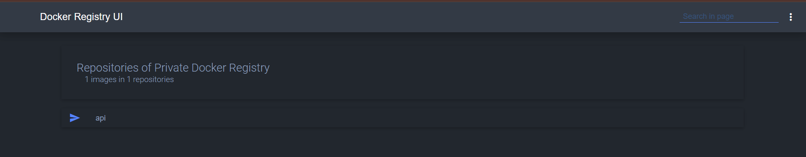

# Compte Rendu - Mini Projet Docker

## Équipe

<div align="center">
<table>
    <tr>
        <th><h3>👨‍🎓 Étudiants</h3></th>
        <th><h3>👨‍🏫 Encadré par</h3></th>
    </tr>
    <tr>
        <td>
            MAJIDI Mohammed<br>
            AMAHOUCH Assia<br>
            AATIQ Sawssan
        </td>
        <td align="center">Pr. RABHI Loubna</td>
    </tr>
</table>
</div>

## L'objectif

Ce mini-projet Docker a pour objectifs principaux :

1. **Containerisation d'une application** : Mettre en pratique les concepts fondamentaux de Docker en containerisant une API Python simple qui gère une liste d'étudiants.

2. **Orchestration multi-services** : Utiliser Docker Compose pour orchestrer plusieurs services interdépendants, notamment un frontend web PHP et une API backend.

3. **Gestion des données persistantes** : Implémenter des volumes Docker pour garantir la persistance des données au-delà du cycle de vie des conteneurs.

4. **Mise en place d'un registre privé** : Créer et utiliser un registre Docker privé pour stocker et distribuer nos images personnalisées.

Ce projet nous permettra d'acquérir des compétences essentielles en DevOps, telles que la création d'images Docker optimisées, la configuration réseau entre conteneurs et la gestion du cycle de vie des applications containerisées.

---

## Création de l'Image Docker

1.  **Image de Base :** _Utilisation de `python:3.8-buster` pour un environnement Python 3.8 sur Debian Buster._

```Dockerfile
    FROM python:3.8-buster
```
> Cette commande définit l'image de base pour notre conteneur, utilisant Python 3.8 sur Debian Buster pour assurer un environnement stable et cohérent.

2. **Informations sur le mainteneur :** _Ajoutez des métadonnées (nom et email) concernant le mainteneur du Dockerfile._

```Dockerfile
    LABEL maintainer="name: votre_nom, email: votre_email@gmail.com"
```
> Cette instruction ajoute des métadonnées au conteneur pour identifier facilement qui est responsable de sa maintenance, ce qui est une bonne pratique pour la documentation.

3. **Script de l'application :** _Copiez le script `student_age.py` dans le répertoire racine du conteneur._

```Dockerfile
    COPY student_age.py /
```
> Cette commande copie le fichier Python principal de notre application dans la racine du conteneur, rendant notre code disponible pour exécution.

4. **Dépendances système :** _Mettez à jour la liste des paquets et installez les en-têtes de développement Python ainsi que les bibliothèques SASL, LDAP et SSL nécessaires à certains paquets Python._

```Dockerfile
    RUN apt update -y && apt install python3-dev libsasl2-dev libldap2-dev libssl-dev -y 
```
> Cette instruction met à jour les référentiels de paquets et installe les dépendances système nécessaires pour compiler certains modules Python qui ont besoin de bibliothèques natives.

5. **Dépendances Python :** _Copiez le fichier `requirements.txt` dans le conteneur et installez tous les paquets Python listés dans ce fichier à l'aide de pip._

```Dockerfile
    COPY requirements.txt /
    RUN pip3 install -r requirements.txt
```
> Ces commandes copient le fichier de dépendances Python puis utilisent pip pour installer toutes les bibliothèques requises par notre application.

6. **Répertoire de données et volume :** _Créez un répertoire `/data` destiné au stockage persistant des données. Déclarez `/data` comme un volume pour que les données survivent à la recréation du conteneur._

```Dockerfile
    RUN mkdir /data
    VOLUME [ "/data" ]
```
> Ces instructions créent un répertoire de données et le déclarent comme volume Docker, permettant la persistance des données même lorsque le conteneur est supprimé et recréé.

7. **Configuration réseau :** _Exposez le port 5000 pour permettre l'accès à l'application en cours d'exécution (probablement un service web)._

```Dockerfile
    EXPOSE 5000
```
> Cette commande indique que notre application écoute sur le port 5000, documentant ainsi le port qui devra être exposé lors de l'exécution du conteneur.

8. **Commande de démarrage :** _Spécifiez que le conteneur doit exécuter le script `student_age.py` avec Python3 comme processus principal._

```Dockerfile
    CMD [ "python3", "student_age.py" ]
```
> Cette instruction définit la commande par défaut à exécuter lorsque le conteneur démarre, lançant notre application Python.

📎 **Fichier Dockerfile :** [Dockerfile](./simple_api/Dockerfile)

---

## Test de l'image Docker

1. **Construction de l'image**

```powershell
$ docker build -t api:1.0 simple_api/
[+] Building 121.1s (11/11) FINISHED                                                                                                       docker:desktop-linux 
 => [internal] load build definition from Dockerfile                                                                                                       0.0s 
 => => transferring dockerfile: 1.59kB                                                                                                                     0.0s 
 => [internal] load metadata for docker.io/library/python:3.8-buster                                                                                       0.7s 
 => [internal] load .dockerignore                                                                                                                          0.0s 
 => => transferring context: 2B                                                                                                                            0.0s 
 => [internal] load build context                                                                                                                          0.1s 
 => => transferring context: 71B                                                                                                                           0.0s 
 => [1/6] FROM docker.io/library/python:3.8-buster@sha256:04c3f641c2254c229fd2f704c5199ff4bea57d26c1c29008ae3a4afddde98709                                50.9s 
 => => resolve docker.io/library/python:3.8-buster@sha256:04c3f641c2254c229fd2f704c5199ff4bea57d26c1c29008ae3a4afddde98709                                 0.1s 
 => => sha256:819d305a9b2210516eaf5929daf6caa015f1f0ffa8be96252cb05d0f283bfff5 19.29MB / 19.29MB                                                          10.7s 
 => => sha256:0ebfe287e9761b9b7dd1703470ff3473a62fe75238f3de01282165f8725968af 6.15MB / 6.15MB                                                             2.3s 
 => => sha256:a2e1e233599c00054fb839db78b4d42e6f12f36b64280aa62d482a3ad0ad7109 191.88MB / 191.88MB                                                        41.5s 
 => => sha256:b1e7e053c9f6f57c6d95002167a6d57aed6aacf04dd2f8e681cb4f74a7ca4381 51.87MB / 51.87MB                                                          35.5s 
 => => sha256:3b1c264c0ad4598c25048a6dbd3030086cc5c74000e11d04ac27944cb116aabb 17.58MB / 17.58MB                                                           9.8s 
 => => sha256:ac8bb7e1a32398e26c129ce64e2ddc3e7ec6c34d93424b247f16049f5a91cff4 50.45MB / 50.45MB                                                          29.2s 
 => => extracting sha256:ac8bb7e1a32398e26c129ce64e2ddc3e7ec6c34d93424b247f16049f5a91cff4                                                                  2.2s
 => => extracting sha256:3b1c264c0ad4598c25048a6dbd3030086cc5c74000e11d04ac27944cb116aabb                                                                  0.6s
 => => extracting sha256:b1e7e053c9f6f57c6d95002167a6d57aed6aacf04dd2f8e681cb4f74a7ca4381                                                                  2.0s
 => => extracting sha256:a2e1e233599c00054fb839db78b4d42e6f12f36b64280aa62d482a3ad0ad7109                                                                  5.1s
 => => extracting sha256:0ebfe287e9761b9b7dd1703470ff3473a62fe75238f3de01282165f8725968af                                                                  0.2s
 => => extracting sha256:819d305a9b2210516eaf5929daf6caa015f1f0ffa8be96252cb05d0f283bfff5                                                                  0.5s
 => => extracting sha256:a11e135762f00d55e3d68410f1aab593ca9850d9c2ca07f69fb5ac353fc99e0a                                                                  0.0s
```
> Cette commande construit notre image Docker nommée "api" avec le tag "1.0" en utilisant les fichiers du répertoire simple_api. Le processus télécharge et extrait l'image de base Python et exécute toutes les instructions du Dockerfile.

2. **Exécution du conteneur**

- Première tentative (Erreur liée à un fichier manquant `student_age.json`)

```powershell
$ docker run --name mytest -p 5000:5000 api:1.0
Traceback (most recent call last):
  File "student_age.py", line 33, in <module>
    student_age_file = open(student_age_file_path, "r")
FileNotFoundError: [Errno 2] No such file or directory: '/data/student_age.json'
```
> Cette première tentative échoue car le fichier de données student_age.json n'est pas présent dans le volume /data du conteneur, provoquant une erreur FileNotFoundError.

- Deuxième tentative après avoir copié le fichier dans le conteneur

```powershell
dell@DESKTOP-1FIQQ8A MINGW64 ~/Documents/Devops/student_list (majidi)
$ docker cp simple_api/student_age.json mytest:/data
Successfully copied 2.05kB to mytest:/data

dell@DESKTOP-1FIQQ8A MINGW64 ~/Documents/Devops/student_list (majidi)
$ docker start mytest
mytest
dell@DESKTOP-1FIQQ8A MINGW64 ~/Documents/Devops/student_list (majidi)
$ docker ps
CONTAINER ID   IMAGE               COMMAND                  CREATED          STATUS          PORTS                    NAMES
b70bea561599   api:1.0             "python3 student_age…"   16 minutes ago   Up 14 minutes   0.0.0.0:5000->5000/tcp   mytest
```
> Ces commandes résolvent le problème en copiant le fichier JSON nécessaire dans le conteneur, puis en démarrant le conteneur. La commande docker ps confirme que le conteneur est en cours d'exécution et que le port 5000 est correctement mappé.

3. **Vérification des logs**

```powershell
$ docker logs mytest
Traceback (most recent call last):
  File "student_age.py", line 33, in <module>
    student_age_file = open(student_age_file_path, "r")
FileNotFoundError: [Errno 2] No such file or directory: '/data/student_age.json'
 * Serving Flask app 'student_age' (lazy loading)
 * Environment: production
   WARNING: This is a development server. Do not use it in a production deployment.
   Use a production WSGI server instead.
 * Debug mode: on
 * Running on all addresses.
   WARNING: This is a development server. Do not use it in a production deployment.
 * Running on http://172.17.0.4:5000/ (Press CTRL+C to quit)
 * Restarting with stat
 * Debugger is active!
 * Debugger PIN: 127-926-424
```
> Les logs montrent l'erreur initiale due au fichier manquant, puis indiquent que l'application Flask a démarré correctement après le redémarrage du conteneur. L'API est maintenant en cours d'exécution en mode debug et accessible via l'adresse 172.17.0.4:5000.

4. **Test avec la commande `curl`**

```powershell
$ curl -u root:root -X GET http://localhost:5000/supmit/api/v1.0/get_student_ages
{
  "student_ages": {
    "Ahmed": "20",
    "Amine": "20",
    "Hiba": "21",
    "Meryem": "23",
    "Omar": "20",
    "Sara": "23"
  }
}
```
---

## Création du Fichier Docker-compose

<details>
  <summary>Clicker pour afficher le code <strong><a href="./docker-compose.yml">docker-compose.yml</a></strong></summary>

```yml
version: "3.8"

services:
  website:
    image: php:apache
    environment:
      - USERNAME=root
      - PASSWORD=root
    volumes:
      - ./website:/var/www/html
    depends_on:
      - simple-api
    ports:
      - "80:80"
      
  simple-api:
    image: api:1.0
    volumes:
      - ./simple-api/student_age.json:/data/student_age.json
    ports:
      - "5000:5000"
    networks:
      - my-network

networks:
  my-network:
    driver: bridge

```
</details>

> Ce fichier docker-compose définit deux services : un site web PHP utilisant Apache et notre API Python. Il configure les variables d'environnement, les volumes pour la persistance des données, les dépendances entre services, et expose les ports nécessaires. Un réseau bridge personnalisé est également créé pour faciliter la communication entre les services.

---

## Exécution avec Docker Compose

1. **Execution:**

```powershell
$ docker-compose up --build
time="2025-03-23T16:13:41Z" level=warning msg="C:\\Users\\dell\\Documents\\Devops\\student_list\\docker-compose.yml: the attribute `version` is obsolete, it will be ignored, please remove it to avoid potential confusion"
[+] Running 4/4
 ✔ Network student_list_my-network      Created                                                                            0.1s 
 ✔ Network student_list_default         Created                                                                            0.1s 
 ✔ Container student_list-simple-api-1  Created                                                                            0.2s 
 ✔ Container student_list-website-1     Created                                                                            0.3s 
Attaching to simple-api-1, website-1
simple-api-1  |  * Serving Flask app 'student_age' (lazy loading)
simple-api-1  |  * Environment: production
simple-api-1  |    WARNING: This is a development server. Do not use it in a production deployment.                             
simple-api-1  |    Use a production WSGI server instead.                                                                        
simple-api-1  |  * Debug mode: on                                                                                               
simple-api-1  |  * Running on all addresses.                                                                                    
simple-api-1  |    WARNING: This is a development server. Do not use it in a production deployment.
simple-api-1  |  * Running on http://172.19.0.2:5000/ (Press CTRL+C to quit)                                                    
simple-api-1  |  * Restarting with stat                                                                                         
website-1     | AH00558: apache2: Could not reliably determine the server's fully qualified domain name, using 172.20.0.2. Set the 'ServerName' directive globally to suppress this message
website-1     | AH00558: apache2: Could not reliably determine the server's fully qualified domain name, using 172.20.0.2. Set the 'ServerName' directive globally to suppress this message
website-1     | [Sun Mar 23 16:13:44.358519 2025] [mpm_prefork:notice] [pid 1:tid 1] AH00163: Apache/2.4.62 (Debian) PHP/8.4.5 configured -- resuming normal operations
website-1     | [Sun Mar 23 16:13:44.358606 2025] [core:notice] [pid 1:tid 1] AH00094: Command line: 'apache2 -D FOREGROUND'
simple-api-1  |  * Debugger is active!                                                                                          
simple-api-1  |  * Debugger PIN: 143-617-910
website-1     | 172.20.0.1 - - [23/Mar/2025:16:14:24 +0000] "GET / HTTP/1.1" 200 531 "-" "Mozilla/5.0 (Windows NT 10.0; Win64; x64) AppleWebKit/537.36 (KHTML, like Gecko) Chrome/134.0.0.0 Safari/537.36"
website-1     | 172.20.0.1 - - [23/Mar/2025:16:14:26 +0000] "GET / HTTP/1.1" 200 531 "-" "Mozilla/5.0 (Windows NT 10.0; Win64; x64) AppleWebKit/537.36 (KHTML, like Gecko) Chrome/134.0.0.0 Safari/537.36"
website-1     | 172.20.0.1 - - [23/Mar/2025:16:14:26 +0000] "GET /favicon.ico HTTP/1.1" 404 487 "http://localhost/" "Mozilla/5.0 (Windows NT 10.0; Win64; x64) AppleWebKit/537.36 (KHTML, like Gecko) Chrome/134.0.0.0 Safari/537.36"
website-1     | 172.20.0.1 - - [23/Mar/2025:16:14:27 +0000] "POST / HTTP/1.1" 200 830 "http://localhost/" "Mozilla/5.0 (Windows NT 10.0; Win64; x64) AppleWebKit/537.36 (KHTML, like Gecko) Chrome/134.0.0.0 Safari/537.36"
website-1     | 172.20.0.1 - - [23/Mar/2025:16:14:26 +0000] "GET / HTTP/1.1" 200 531 "-" "Mozilla/5.0 (Windows NT 10.0; Win64; x64) AppleWebKit/537.36 (KHTML, like Gecko) Chrome/134.0.0.0 Safari/537.36"
website-1     | 172.20.0.1 - - [23/Mar/2025:16:14:26 +0000] "GET /favicon.ico HTTP/1.1" 404 487 "http://localhost/" "Mozilla/5.0 (Windows NT 10.0; Win64; x64) AppleWebKit/537.36 (KHTML, like Gecko) Chrome/134.0.0.0 Safari/537.36"
website-1     | 172.20.0.1 - - [23/Mar/2025:16:14:27 +0000] "POST / HTTP/1.1" 200 830 "http://localhost/" "Mozilla/5.0 (Windows NT 10.0; Win64; x64) AppleWebKit/537.36 (KHTML, like Gecko) Chrome/134.0.0.0 Safari/537.36"
website-1     | 172.20.0.1 - - [23/Mar/2025:16:14:35 +0000] "GET / HTTP/1.1" 200 531 "-" "Mozilla/5.0 (Windows NT 10.0; Win64; x64) AppleWebKit/537.36 (KHTML, like Gecko) Chrome/134.0.0.0 Safari/537.36"
```
> Cette commande lance tous les services définis dans notre docker-compose.yml. Les logs montrent la création des réseaux et conteneurs, le démarrage de l'API Flask et du serveur Apache. On peut voir que les deux services démarrent correctement et commencent à traiter des requêtes HTTP.

2. **Resultat:**

<div style="text-align: center; display: flex; justify-content: center; align-items: center;">



</div>

> L'image montre l'interface web qui interagit avec notre API. Cette page affiche les données des étudiants avec leurs âges, récupérées depuis l'API Python, démontrant que l'architecture multi-conteneurs fonctionne correctement.

---

## Mise en Place d'un Registre Docker Privé

```yml
version: '3.8'

services:
  registry:
    image: registry:2
    container_name: private-registry
    ports:
      - "5000:5000"
    environment:
      - REGISTRY_HTTP_HEADERS_Access-Control-Allow-Origin=["*"]
      - REGISTRY_HTTP_HEADERS_Access-Control-Allow-Methods=["HEAD", "GET", "OPTIONS", "DELETE"]
      - REGISTRY_HTTP_HEADERS_Access-Control-Allow-Headers=["Authorization"]
    volumes:
      - registry-data:/var/lib/registry

  registry-ui:
    image: joxit/docker-registry-ui:latest
    container_name: registry-ui
    ports:
      - "80:80"
    environment:
      - REGISTRY_TITLE=Private Docker Registry
      - REGISTRY_URL=http://localhost:5000
    depends_on:
      - registry

volumes:
  registry-data:
```

> Ce fichier docker-compose configure un registre Docker privé avec une interface utilisateur web. Il définit deux services : un registre Docker standard sur le port 5000 avec les en-têtes CORS appropriés, et une interface utilisateur graphique accessible sur le port 8080. Un volume persistant "registry-data" est créé pour stocker les images Docker de manière durable.

---

## Execution et test du docker compose registry

1. **Execution du docker build**

```powershell
dell@DESKTOP-1FIQQ8A MINGW64 ~/Documents/Devops/student_list (majidi)
$ docker-compose -f docker-compose-registry.yml up -d
time="2025-03-23T20:45:31Z" level=warning msg="C:\\Users\\dell\\Documents\\Devops\\student_list\\docker-compose-registry.yml: th
will be ignored, please remove it to avoid potential confusion"                                                                 [+] Running 3/3
 ✔ Network student_list_default  Created                                       0.1s
 ✔ Container private-registry    Started                                       0.9s
 ✔ Container registry-ui         Started                                       1.3s

```
> Cette commande lance notre registre Docker privé et son interface utilisateur en mode détaché (en arrière-plan). Le fichier docker-compose-registry.yml est utilisé pour définir les services, et les conteneurs sont créés et démarrés avec succès.

2. **Ajout tag de l'image**

```powershell
dell@DESKTOP-1FIQQ8A MINGW64 ~/Documents/Devops/student_list (majidi)
$ docker tag api:1.0 localhost:5000/api:1.0
```
> Cette commande ajoute un tag à notre image API pour la préparer au push vers notre registre local. Le format "localhost:5000" indique que l'image sera envoyée au registre Docker s'exécutant sur le port 5000 de la machine locale.

3. **Push l'image**

```powershell
$ docker push localhost:5000/api:1.0
The push refers to repository [localhost:5000/api]
4748f1c3239c: Pushed
5e4e21ea7d04: Pushed
a2e1e233599c: Pushed
0beb01b68673: Pushed
819d305a9b22: Pushed
f3fe20f4bc70: Pushed
42ad9c7e8b94: Pushed
3b1c264c0ad4: Pushed
0ebfe287e976: Pushed
e073bbb7fb4c: Pushed
42ad9c7e8b94: Pushed
3b1c264c0ad4: Pushed
0ebfe287e976: Pushed
e073bbb7fb4c: Pushed
3b1c264c0ad4: Pushed
0ebfe287e976: Pushed
e073bbb7fb4c: Pushed
0ebfe287e976: Pushed
e073bbb7fb4c: Pushed
e073bbb7fb4c: Pushed
a11e135762f0: Pushed
a11e135762f0: Pushed
ac8bb7e1a323: Pushed
d5910363b24a: Pushed
b1e7e053c9f6: Pushed
1.0: digest: sha256:fbe74239aed2271b2893820d1f30edc8a195004e1861d9378d93b2dda99c40dd size: 856
```
> Cette commande envoie l'image taguée vers notre registre Docker privé. Les logs montrent que chaque couche de l'image est téléversée avec succès vers le registre local.

4. **Verification du registre**

- En utilisant la commande `curl`.

```powershell
$ curl http://localhost:5000/v2/_catalog
{"repositories":["api"]}
```
> Cette requête curl interroge l'API du registre Docker pour lister tous les dépôts disponibles. La réponse confirme que notre image "api" est bien présente dans le registre.

- En utilisant Registry UI.

<div>



</div>

> L'image montre l'interface utilisateur web du registre Docker, confirmant visuellement que notre image api:1.0 a été correctement poussée et est maintenant stockée dans notre registre privé.

---

## Conclusion

Ce mini-projet Docker a permis de mettre en œuvre plusieurs concepts fondamentaux de la conteneurisation et de l'orchestration d'applications. À travers la réalisation des différentes étapes, nous avons acquis une expérience pratique sur :

1. **La création d'images Docker** via un Dockerfile bien structuré, intégrant les bonnes pratiques en termes de couches, de dépendances et de configuration.

2. **La gestion des volumes et de la persistance des données**, démontrant comment les données peuvent survivre au cycle de vie des conteneurs.

3. **L'orchestration multi-conteneurs** avec Docker Compose, illustrant comment configurer et faire communiquer différents services (API Python et serveur web PHP) au sein d'un même réseau isolé.

4. **La mise en place d'un registre Docker privé**, essentielle pour gérer et distribuer des images personnalisées dans un environnement d'entreprise ou de développement collaboratif.

Ce projet souligne l'importance de Docker dans le développement moderne, où la reproductibilité des environnements, l'isolation des applications et la portabilité sont devenues des exigences essentielles. La maîtrise de ces concepts constitue un atout majeur pour tout professionnel de la DevOps et du développement logiciel.

Les compétences acquises ici forment une base solide pour aborder des problématiques plus complexes comme l'intégration continue, le déploiement continu et l'orchestration à grande échelle avec des outils comme Kubernetes.